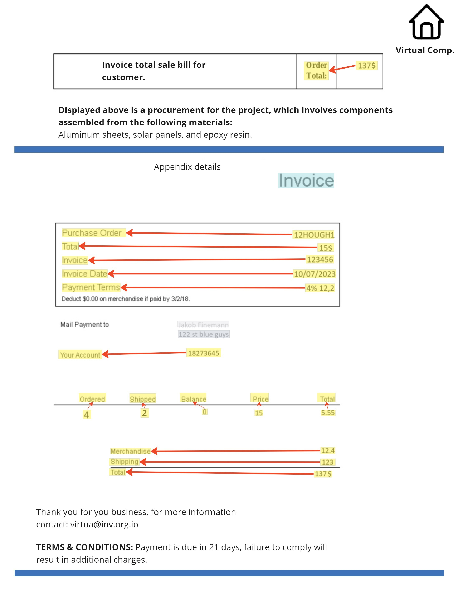

git p# KVP10k

## 1. Introduction:

**KVP10k** is a dataset of 10,000 pages annotated for Key-Value Pair (KVP) extraction from business documents, featuring linked rectangles, from value to its matching key, and text labels.<br>
We also provide code for downloading and preparing the dataset, model training, and benchmarking, serving as a foundation for model comparison and evaluation, as detailed in our paper.

The related paper can be found here: [here](https:/localhost)

### 1.1. Data Source

The data used in this project is downloaded from [Hugging Face](https://huggingface.co/datasets). You can access and explore the dataset directly through this [link](https://huggingface.co/datasets/ibm/KVP10k).

Please ensure to check the dataset's usage rights and licensing terms before using it in your projects.
 


## 2. Downloading and Preparing the dataset for traininig and evaluation

### 2.1. The KVP10k dataset

The **KVP10k** dataset contains 10,000 annotated pages, each containing annotation matching for KVP extraction tasks, in the following format.<br>
The annotations correspond to images that have been extracted from PDF documents.

```json
{
  "rectangles": [
    {
      "_id": "48758be2-7508-4f9c-8198-3cbc867d8ce0",
      "attributes": {
        "Linking": {
          "state": "editable",
          "value": "71dae826-d65b-45ae-bcfa-04b9fe754315"
        }
      },
      "color": "rgb(253, 255, 0)",
      "coordinates": [
        {"x": 0.180248, "y": 0.593932},
        {"x": 0.282669, "y": 0.593932},
        {"x": 0.282669, "y": 0.613686},
        {"x": 0.180248, "y": 0.613686}
      ],
      "label": "Text",
    }
  ],
  "image_url": "https://ae.ucr.edu/sites/default/files/2019-05/DPP2005-r15-FINAL.pdf",
  "page_number": 212,
  "hash_name": "0a050bcc3ace2ed3907d22f8dacc5adf0d960d8c5c5a692afd72a17da13b7ee4"
}
```

- We define `unkeyed_value` type list: name, date, address, phone, email, website, year, document type, document title, text  
- The annotation per each image contains:
  - A list of rectangles described by:
    - `_id`: the rectangle id
    - `coordinates`: 4 coordinates representing the box around the key or value (the coordinates are relative to the page size and take values between 0 and 1)
    - `label`: `Text`, `unvalued_key` or one of the values from `unkeyed_value` type list
    - `Linking`: the id of the rectangle key (empty if the rectangle is key, unvalued_key or unkeyed_value)
  - Additional metatdata:
    - `image_url`: the url to download the pdf
    - `page_number`: the pdf page number
    - `hash_name`: name of the image

<p align="center">
  <strong>Annotation example</strong><br>
  
</p>

### 2.2. Preparing the dataset

### 2.2.1. Prerequisite:

### Download tessdata

```bash
mkdir /path/to/tessdata
wget --quiet https://github.com/tesseract-ocr/tessdata/raw/4.0.0/eng.traineddata -O /path/to/tessdata/eng.traineddata
```

### 2.2.2. Setting up environment for only preparing the dataset :


```bash
git clone https://github.ibm.com/Video-AI/KVP10k.git
cd KVP10k/
                    
conda create -y -n KVP10k python=3.11  
conda activate KVP10k                  

pip3 install --only-binary "matplotlib" --only-binary "tesserocr"  -e '.'
```


### 2.2.3. Download and prepare dataset:

We provide in this repository a `download_dataset.py` script that for each annotation json:

- Download the matching pdf following the `image_url` and extracting the image from `page_number`
- Run OCR (tesseract) on the extracted image
- Create the following `ground_truth` format using fusion code between the annotation and OCR
- Save all the data in the following structure of dataset

```bash
python download_dataset.py --dataset_root_folder <path to dataset root folder> --tessdata_path <path to tessdata folder>
```

This repository assumes the following structure of dataset:
```bash
> tree dataset
dataset
├── test
│   ├── gts
│         ├── {image1}.json
│         ├── {image2}.json
│               .
│               .
│   ├── ocr
│         ├── {image1}.json
│         ├── {image2}.json
│               .
│               .
│   ├── images
│         ├── {image1}.png
│         ├── {image2}.png
│               .
│               .
│   ├── annotation
│         ├── {image1}.json
│         ├── {image2}.json
│               .
│               .
│                          
├── train
│   ├── gts
│         ├── {image1}.json
│         ├── {image2}.json
│               .
│               .
│   ├── ocr
│         ├── {image1}.json
│         ├── {image2}.json
│               .
│               .
│   ├── images
│         ├── {image1}.png
│         ├── {image2}.png
│               .
│               .
│   ├── annotation
│         ├── {image1}.json
│         ├── {image2}.json
│               .
│               .
│                          
```

- The structure of `ground_truth` json, which differentiate between 3 types of KVP: `unkeyed`, `unvalued`, `kvp`

```json
{
  "kvps_list" : [
    {
      "type" : "unkeyed",
      "key" : {
        "text" : "{matching name from unkeyed type list}"
      },
      "value" : {
        "text" : "Associated Value Text 0",
        "bbox" : [x1 , y1 , x2 , y2]
      }
    },
    {
      "type" : "unvalued",
      "key" : {
        "text" : "Example key text 1",
        "bbox" : [x1 , y1 , x2 , y2]
      }
    },
    {
      "type" : "kvp",
      "key" : {
        "text" : "Example Key Text 2",
        "bbox" : [x1 , y1 , x2 , y2]
      },
      "value" : {
        "text" : "Associated Value Text 2",
        "bbox" : [x1 , y1 , x2 , y2]
      }
    }
  ]
}
```

## 3. View and Statistics utilities for the dataset, Train and Benchmark

### 3.1. Setting up the environment:

```bash
git clone https://github.ibm.com/Video-AI/KVP10k.git
cd KVP10k/

#for conda env                         | #for virtual env
conda create -n KVP10k python=3.11     | python -m venv KVP10k
conda activate KVP10k                  | source KVP10k/bin/activate

pip3 install --only-binary "matplotlib" -e '.'
```

### 3.2. View and Statistics utilities for the dataset

We provide in the repository utilities to view and get statistics on the dataset

**1. Annotation Visualization**
```bash
python visualize_annotation.py --image_file <path to image file> --annotation_file <path to annotation file>
```

**2. groud_truth Visualization**

```bash
python visualize_gt.py --image_file <path to image file> --gt_file <path to groud_truth file>
```

**3. Dataset statistics**
```bash
python dataset_statistics.py --dataset_root_path <path to dataset root folder> [--splits test train]
```

### 3.3. train

For training A100 with 80GB is needed

```bash
python train.py --save_path <Path for saving the checkpoint> --training_folder <Path for the training data>
```

### 3.3. Inference

For inference A100 with 80GB/40GB is needed

```bash
python inference.py  --pretrained <Path for savein the checkpoint>/last.ckpt --test_folder <Path for the test data> --save_path <Path for storing the inference jsons>
```

### 3.4. Benchmarking

```bash
python benchmark.py  --gt_folder <Path for the ground truth jsons> --inference_folder <Path for the inference jsons folder>
```
